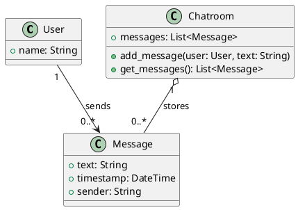

# AISE Chatroom — Spezifikation

## Projektbeschreibung

Einfacher webbasierter Klassenchat (MVP) für den CAS-Unterricht.  
Entwickelt nach dem Prinzip der **Specification-Driven Development (SDD)**.

- Nachrichten werden in `messages.json` gespeichert (persistent über Neustarts)
- Eine einzige Seite, ein einziger Endpoint
- Deployment auf Render.com

---

## Architektur

```
# Architecture

## Purpose
Simple web-based messenger with one page and one endpoint.

## Components
- Browser UI
- Flask app
- JSON-file message store (`messages.json`)

## Endpoint
- GET /   show page
- POST /  send message

## Stack
- Python
- Flask
- Gunicorn
- HTML/CSS
- Render Web Service

## Files
- app.py
- templates/index.html
- static/style.css
- requirements.txt
- render.yaml
- README.md

## Deployment
Render Web Service with:
- Build command: pip install -r requirements.txt
- Start command: gunicorn app:app

## Limitation
Messages are lost on restart or redeploy.
```

---

## Domainmodell (Schritt 1 — DDD)

### Klassendiagramm (PlantUML)



### Klassen & Attribute

| Klasse | Attribut / Methode | Typ | Beschreibung |
|---|---|---|---|
| `User` | `name` | String | Anzeigename des Nutzers |
| `Message` | `text` | String | Nachrichteninhalt |
| `Message` | `timestamp` | DateTime | Sendezeitpunkt (serverseitig gesetzt) |
| `Message` | `sender` | String | Name des Absenders (kopiert von User.name) |
| `Chatroom` | `messages` | List\<Message\> | In-Memory-Liste aller Nachrichten |
| `Chatroom` | `add_message()` | void | Neue Nachricht hinzufügen |
| `Chatroom` | `get_messages()` | List\<Message\> | Alle Nachrichten zurückgeben |

### Beziehungen

- `User` **sends** `0..*` `Message` — ein Nutzer kann beliebig viele Nachrichten senden
- `Chatroom` **stores** `0..*` `Message` — der Chatraum hält alle Nachrichten im Speicher

### Designentscheidungen

- `User` hat nur einen Namen (kein Passwort, kein Login) — bewusste MVP-Vereinfachung
- `Message.sender` ist ein String, keine Objektreferenz — vereinfacht die In-Memory-Haltung
- `timestamp` wird serverseitig gesetzt für Konsistenz
- `Chatroom` als Klasse modelliert, obwohl im Code eine einfache Liste genügt — für Lesbarkeit der Spezifikation

---

## Feature-Katalog (Schritt 2 — MVP-Anforderungen)

### F1 — Nutzername eingeben

| | |
|---|---|
| **Zweck** | Nutzer identifiziert sich mit einem Namen, bevor er Nachrichten senden kann |
| **Anforderungen** | REQ-F1.1: Der Nutzer muss einen Namen eingeben können (Freitextfeld) |
| | REQ-F1.2: Der Name wird im Browser gespeichert (z.B. via Cookie oder Session), damit er nicht bei jeder Nachricht neu eingegeben werden muss |
| | REQ-F1.3: Der Name darf nicht leer sein |
| | REQ-F1.4: Es gibt keine Registrierung oder Authentifizierung |
| **Umsetzungsidee** | Name wird als verstecktes Feld im Formular mitgesendet; beim ersten Besuch wird ein Namensfeld angezeigt |

---

### F2 — Nachricht senden

| | |
|---|---|
| **Zweck** | Nutzer kann eine Textnachricht an alle Teilnehmer senden |
| **Anforderungen** | REQ-F2.1: Der Nutzer kann eine Textnachricht eingeben und absenden |
| | REQ-F2.2: Das Absenden erfolgt per Button oder Enter-Taste |
| | REQ-F2.3: Das Textfeld wird nach dem Absenden geleert |
| | REQ-F2.4: Eine leere Nachricht wird nicht gesendet |
| | REQ-F2.5: Die Nachricht wird serverseitig mit Timestamp und Sendername gespeichert |
| **Umsetzungsidee** | HTML-Formular mit POST-Request an `/`; serverseitig wird die Nachricht dem In-Memory-Store hinzugefügt |

---

### F3 — Nachrichten anzeigen

| | |
|---|---|
| **Zweck** | Alle Teilnehmer sehen die gesendeten Nachrichten |
| **Anforderungen** | REQ-F3.1: Alle gesendeten Nachrichten werden auf der Seite angezeigt |
| | REQ-F3.2: Jede Nachricht zeigt Sendername, Text und Zeitstempel |
| | REQ-F3.3: Nachrichten sind chronologisch sortiert (älteste zuerst) |
| | REQ-F3.4: Die neueste Nachricht ist beim Laden sichtbar (Scroll-Position unten) |
| **Umsetzungsidee** | GET `/` liefert die gerenderte HTML-Seite mit allen Nachrichten aus dem In-Memory-Store |

---

### F4 — Seite aktualisieren

| | |
|---|---|
| **Zweck** | Nutzer sieht neue Nachrichten anderer Teilnehmer |
| **Anforderungen** | REQ-F4.1: Die Seite aktualisiert sich automatisch alle 5 Sekunden |
| | REQ-F4.2: Ein manuelles Neuladen der Seite zeigt ebenfalls alle aktuellen Nachrichten |
| **Umsetzungsidee** | `<meta http-equiv="refresh" content="5">` im HTML-Header (einfachste Lösung, kein JavaScript nötig) |

---

### Nicht im MVP (explizit ausgeschlossen)

- Benutzerregistrierung / Login / Passwörter
- Private Nachrichten / Channels
- Dateianhänge oder Medien
- Persistente Speicherung (Datenbank)
- Moderation / Admin-Rolle
- Emojis / Formatierung

---

## Use Cases (Schritt 3 — Interaktionsszenarien)

### UC1 — Chatroom betreten

| | |
|---|---|
| **Akteur** | Nutzer (Schüler/Lehrperson) |
| **Vorbedingung** | Nutzer öffnet die App-URL im Browser; noch kein Name gesetzt |
| **Nachbedingung** | Name ist im Browser gespeichert; Chatroom-Seite wird angezeigt |

**Hauptszenario:**
1. Nutzer ruft die URL auf
2. System erkennt, dass noch kein Name gesetzt ist
3. System zeigt ein Namenseingabefeld an
4. Nutzer gibt seinen Namen ein und bestätigt
5. System speichert den Namen (Cookie/Session)
6. System zeigt die Chatroom-Seite mit bestehenden Nachrichten an

**Alternativszenario A — Name bereits gesetzt:**
- Schritt 2: System erkennt gespeicherten Namen → springt direkt zu Schritt 6

**Alternativszenario B — Leerer Name:**
- Schritt 4: Nutzer lässt das Feld leer → System zeigt Fehlermeldung, bleibt auf Namenseingabe

---

### UC2 — Nachricht senden

| | |
|---|---|
| **Akteur** | Nutzer (Schüler/Lehrperson) |
| **Vorbedingung** | Nutzer ist im Chatroom (Name gesetzt) |
| **Nachbedingung** | Nachricht ist im In-Memory-Store gespeichert und für alle sichtbar |

**Hauptszenario:**
1. Nutzer gibt Text ins Nachrichtenfeld ein
2. Nutzer klickt "Senden" oder drückt Enter
3. System nimmt Name, Text und aktuellen Timestamp
4. System speichert die Nachricht im In-Memory-Store
5. System lädt die Seite neu und zeigt die neue Nachricht an
6. Nachrichtenfeld ist geleert

**Alternativszenario A — Leere Nachricht:**
- Schritt 2: Text ist leer → System ignoriert die Anfrage, kein Eintrag wird erstellt

**Alternativszenario B — Kein Name gesetzt:**
- Schritt 3: Name fehlt → System leitet zurück zur Namenseingabe (UC1)

---

### UC3 — Nachrichten lesen

| | |
|---|---|
| **Akteur** | Nutzer (Schüler/Lehrperson) |
| **Vorbedingung** | Nutzer ist im Chatroom |
| **Nachbedingung** | Nutzer sieht alle aktuellen Nachrichten |

**Hauptszenario:**
1. Nutzer lädt die Seite (manuell oder durch Auto-Refresh)
2. System liest alle Nachrichten aus dem In-Memory-Store
3. System rendert die Nachrichten chronologisch (älteste zuerst)
4. Jede Nachricht zeigt: Sendername, Text, Zeitstempel
5. Browser scrollt automatisch ans Ende (neueste Nachricht sichtbar)

**Alternativszenario A — Keine Nachrichten vorhanden:**
- Schritt 3: Store ist leer → System zeigt Hinweistext "Noch keine Nachrichten"

---

### UC4 — Nachrichten automatisch aktualisieren

| | |
|---|---|
| **Akteur** | System (automatisch) |
| **Vorbedingung** | Nutzer hat die Chatroom-Seite geöffnet |
| **Nachbedingung** | Seite zeigt aktuellen Stand aller Nachrichten |

**Hauptszenario:**
1. Browser wartet 5 Sekunden nach dem letzten Laden
2. Browser lädt die Seite automatisch neu (Meta-Refresh)
3. System liefert aktuelle Nachrichten aus dem In-Memory-Store
4. Nutzer sieht neue Nachrichten ohne manuelles Eingreifen

---

### Komplette Liste funktionaler Anforderungen

| ID | Anforderung | Use Case |
|---|---|---|
| REQ-F1.1 | Nutzer kann einen Namen eingeben (Freitextfeld) | UC1 |
| REQ-F1.2 | Name wird im Browser gespeichert (Cookie/Session) | UC1 |
| REQ-F1.3 | Leerer Name wird abgewiesen (Fehlermeldung) | UC1 |
| REQ-F1.4 | Kein Login / keine Registrierung erforderlich | UC1 |
| REQ-F2.1 | Nutzer kann Textnachricht eingeben und absenden | UC2 |
| REQ-F2.2 | Absenden per Button oder Enter-Taste | UC2 |
| REQ-F2.3 | Nachrichtenfeld wird nach dem Senden geleert | UC2 |
| REQ-F2.4 | Leere Nachricht wird nicht gespeichert | UC2 |
| REQ-F2.5 | Nachricht wird mit Timestamp und Sendername gespeichert | UC2 |
| REQ-F3.1 | Alle Nachrichten werden auf der Seite angezeigt | UC3 |
| REQ-F3.2 | Jede Nachricht zeigt Sendername, Text und Zeitstempel | UC3 |
| REQ-F3.3 | Nachrichten sind chronologisch sortiert (älteste zuerst) | UC3 |
| REQ-F3.4 | Neueste Nachricht ist beim Laden sichtbar (Scroll unten) | UC3 |
| REQ-F3.5 | Bei leerem Store wird ein Hinweistext angezeigt | UC3 |
| REQ-F4.1 | Seite aktualisiert sich automatisch alle 5 Sekunden | UC4 |
| REQ-F4.2 | Manuelles Neuladen zeigt ebenfalls aktuelle Nachrichten | UC4 |

---

## Requirements Quality Check (Schritt 4)

### Bewertungskriterien: Konsistenz · Eindeutigkeit · Notwendigkeit · Vollständigkeit

---

### Befunde & Korrekturen

| # | Kriterium | Befund | Massnahme |
|---|---|---|---|
| 1 | Eindeutigkeit | REQ-F1.2: "Cookie **oder** Session" ist zweideutig — Session erfordert serverseitige Speicherung, die wir nicht haben | Präzisiert: nur Cookie |
| 2 | Eindeutigkeit | REQ-F3.4: "Scroll-Position unten" unklar — wie ohne JavaScript? | Präzisiert: HTML-Anker `#bottom` am Ende der Nachrichtenliste |
| 3 | Konsistenz | REQ-F3.5 erscheint nur in der Anforderungstabelle, fehlt aber im Feature F3 | REQ-F3.5 in F3-Tabelle nachgetragen |
| 4 | Notwendigkeit | REQ-F4.2 "Manuelles Neuladen zeigt aktuelle Nachrichten" ist trivial für jede Web-App | Als Akzeptanzkriterium behalten, nicht als eigenständige Anforderung |
| 5 | Vollständigkeit | Kein Limit für Nachrichtenlänge — könnte UI brechen | Neu: REQ-F2.6: Maximale Nachrichtenlänge 500 Zeichen |
| 6 | Vollständigkeit | Timestamp-Format nicht spezifiziert | Neu: REQ-F3.6: Format `HH:MM · DD.MM.YYYY` |
| 7 | Vollständigkeit | Verhalten bei Server-Neustart nicht dokumentiert | Bereits in Architektur als "Limitation" vermerkt — ausreichend |
| 8 | Konsistenz | Zwei Nutzer können denselben Namen verwenden — kein Uniqueness-Constraint | Akzeptiert für MVP, dokumentiert als bewusste Entscheidung |

---

### Finalisierte Anforderungsliste (nach Quality Check)

| ID | Anforderung | Use Case | Änderung |
|---|---|---|---|
| REQ-F1.1 | Nutzer kann einen Namen eingeben (Freitextfeld) | UC1 | — |
| REQ-F1.2 | Name wird im Browser als Cookie gespeichert | UC1 | präzisiert (war: Cookie/Session) |
| REQ-F1.3 | Leerer Name wird abgewiesen (Fehlermeldung) | UC1 | — |
| REQ-F1.4 | Kein Login / keine Registrierung erforderlich | UC1 | — |
| REQ-F2.1 | Nutzer kann Textnachricht eingeben und absenden | UC2 | — |
| REQ-F2.2 | Absenden per Button oder Enter-Taste | UC2 | — |
| REQ-F2.3 | Nachrichtenfeld wird nach dem Senden geleert | UC2 | — |
| REQ-F2.4 | Leere Nachricht wird nicht gespeichert | UC2 | — |
| REQ-F2.5 | Nachricht wird mit Timestamp und Sendername gespeichert | UC2 | — |
| REQ-F2.6 | Nachrichtenlänge ist auf 500 Zeichen begrenzt | UC2 | **neu** |
| REQ-F3.1 | Alle Nachrichten werden auf der Seite angezeigt | UC3 | — |
| REQ-F3.2 | Jede Nachricht zeigt Sendername, Text und Zeitstempel | UC3 | — |
| REQ-F3.3 | Nachrichten sind chronologisch sortiert (älteste zuerst) | UC3 | — |
| REQ-F3.4 | Neueste Nachricht sichtbar via HTML-Anker `#bottom` | UC3 | präzisiert (war: "Scroll unten") |
| REQ-F3.5 | Bei leerem Store wird Hinweistext angezeigt | UC3 | — |
| REQ-F3.6 | Zeitstempel-Format: `HH:MM · DD.MM.YYYY` | UC3 | **neu** |
| REQ-F4.1 | Seite aktualisiert sich automatisch alle 5 Sekunden | UC4 | — |
| REQ-F4.2 | Manuelles Neuladen zeigt aktuelle Nachrichten *(Akzeptanzkriterium)* | UC4 | abgestuft |

### Bewusste Designentscheidungen (keine Anforderungen)

- Keine Eindeutigkeit bei Nutzernamen — zwei Personen können denselben Namen verwenden (MVP-Vereinfachung)
- Nachrichten gehen bei Server-Neustart verloren — dokumentiertes Limitation, kein Bug

---

## Code-Generierung & Deployment (Schritt 6)

### Projektstruktur

```
AISE-Chatroom/
├── app.py                  ← Flask-App (ein Endpoint GET + POST /)
├── requirements.txt        ← Abhängigkeiten: flask, gunicorn
├── render.yaml             ← Render-Deployment-Konfiguration
├── templates/
│   └── index.html          ← Jinja2-Template (Namenseingabe + Chat)
├── static/
│   └── style.css           ← Styling
├── spec.md                 ← diese Spezifikation
└── prototype/
    └── index.html          ← UI-Prototyp aus Schritt 5
```

---

### Implementierungsdetails

#### app.py — Flask-Anwendung

- Einziger Endpoint `GET /` / `POST /` (gemäss Architektur)
- Storage-Backend wird automatisch gewählt: PostgreSQL wenn `DATABASE_URL` gesetzt, sonst `messages.json`
- POST unterscheidet zwei Aktionen via verstecktem `action`-Feld:
  - `set_name` → setzt Cookie `username` (max_age 24h), Redirect nach `/`
  - `send_message` → speichert Nachricht, Redirect nach `/#bottom`
- Post-Redirect-Get (PRG) Pattern verhindert doppelte Submissions bei Seitenrefresh
- Timestamp wird serverseitig mit `datetime.now()` gesetzt (REQ-F2.5)

#### templates/index.html — Jinja2-Template

- Zeigt Namenseingabe-Screen wenn Cookie `username` fehlt (UC1)
- Zeigt Chat-Screen wenn Name gesetzt (UC2–UC4)
- `<meta http-equiv="refresh" content="5; url=/#bottom">` für Auto-Refresh + Scroll (REQ-F4.1, REQ-F3.4)
- Minimales JavaScript nur für Live-Zeichenzähler (REQ-F2.6)
- Eigene Nachrichten werden per Jinja2-Kondition `{{ 'own' if m.sender == name else 'other' }}` gestylt

#### Anforderungs-Abdeckung

| Anforderung | Umsetzung |
|---|---|
| REQ-F1.1 | `<input name="name">` im Namensformular |
| REQ-F1.2 | `resp.set_cookie('username', new_name, max_age=86400)` |
| REQ-F1.3 | Server prüft `if not new_name`, rendert Fehlermeldung |
| REQ-F1.4 | Kein Login-System vorhanden |
| REQ-F2.1 | `<input name="message">` + Submit-Button |
| REQ-F2.2 | Standard-HTML-Formular: Enter löst Submit aus |
| REQ-F2.3 | Redirect nach POST leert das Formular (PRG) |
| REQ-F2.4 | Server prüft `if text and len(text) <= 500` |
| REQ-F2.5 | `datetime.now().strftime('%H:%M · %d.%m.%Y')` |
| REQ-F2.6 | `maxlength="500"` im Input + serverseitige Prüfung |
| REQ-F3.1–F3.3 | Jinja2-Loop über `messages` in Einfügereihenfolge |
| REQ-F3.4 | `<div id="bottom"></div>` + `url=/#bottom` im Meta-Refresh |
| REQ-F3.5 | `<p class="empty-hint">…</p>` |
| REQ-F3.6 | `strftime('%H:%M · %d.%m.%Y')` |
| REQ-F4.1 | `<meta http-equiv="refresh" content="5; url=/#bottom">` |
| REQ-F4.2 | GET `/` liest immer aktuellen Stand aus `messages` |

---

### Lokaler Betrieb

```bash
pip install -r requirements.txt
flask run --host=0.0.0.0 --port=5000
```

App läuft auf: http://localhost:5000

Mehrere Nutzer simulieren: mehrere Browser-Tabs mit verschiedenen Namen öffnen.

---

### Deployment auf Render.com

1. Dateien in ein GitHub-Repository pushen: https://github.com/Iwo13/AISE-Chatroom
2. render.com → **New Web Service** → GitHub-Repo verbinden → Branch `main`
3. Einstellungen im Dashboard manuell setzen (render.yaml überschreibt bestehende Services **nicht**):
   - Build Command: `pip install -r requirements.txt`
   - Start Command: `gunicorn app:app --bind 0.0.0.0:$PORT`
4. **Save Changes** → Render deployt automatisch
5. **Live-URL: https://aise-chatroom.onrender.com**

> **Hinweis:** `render.yaml` greift nur beim erstmaligen Verbinden via Blueprint, nicht bei manuell erstellten Services. Start Command im Dashboard muss `--bind 0.0.0.0:$PORT` enthalten, sonst antwortet Gunicorn nicht auf Renders internen Port.

### Persistenz

| Umgebung | Storage | Verhalten |
|---|---|---|
| Lokal (kein `DATABASE_URL`) | `messages.json` | Persistent über Neustarts |
| Render (mit `DATABASE_URL`) | PostgreSQL | Dauerhaft persistent |

### PostgreSQL-Setup auf Render

1. Render Dashboard → **New +** → **PostgreSQL** → Name: `aise-chatroom-db`, Plan: Free → **Create Database**
2. In der Datenbank-Übersicht → Abschnitt **Connections** → **Internal Database URL** kopieren
3. Web Service `aise-chatroom` → **Environment** → Add Environment Variable:
   - Key: `DATABASE_URL`
   - Value: *(Internal Database URL)*
4. **Save Changes** → Render deployt automatisch

### Bekannte Einschränkungen

- Render Free PostgreSQL: 1 GB Speicher, wird nach 90 Tagen Inaktivität gelöscht
- Bei mehreren Gunicorn-Workern könnten gleichzeitige Schreibzugriffe kollidieren — für das kostenlose Render-Tier mit einem Worker kein Problem

---

## Reflexion: SWOT — Specification-Driven Development (A4)

*Perspektive: Einsatz von SDD in der eigenen Organisation*

### Stärken

| | |
|---|---|
| **Klare Anforderungen vor dem Code** | Die Spezifikation zwingt das Team, Konzepte und Anforderungen zu klären, bevor Code entsteht — reduziert Missverständnisse |
| **Nachvollziehbare Entscheidungen** | Designentscheidungen (z.B. kein Login, kein DB) sind dokumentiert und begründbar |
| **KI-Unterstützung skaliert** | Mit einer guten Spec kann KI grossen Teil der Implementierung übernehmen — auch ohne tiefe Programmierkenntnisse im Team |
| **Traceability** | Jede Anforderung (REQ-ID) ist auf Code zurückführbar — erleichtert Reviews und Änderungen |
| **Qualitätssicherung früh im Prozess** | Requirements Quality Check (Schritt 4) findet Lücken bevor Code geschrieben wird |

### Schwächen

| | |
|---|---|
| **Aufwand für die Spezifikation** | Klassendiagramm, Use Cases, Feature-Katalog — für ein kleines MVP ist der Dokumentationsaufwand relativ hoch |
| **Spezifikation kann veralten** | Sobald der Code evoliert, hinkt die Spec nach — Pflege erfordert Disziplin |
| **KI-generierter Code braucht Verifikation** | Der Code ist nicht automatisch korrekt — menschliches Review und Testen bleibt notwendig |
| **Schwierig bei explorativen Projekten** | Wenn Anforderungen unklar oder laufend ändern, bremst eine starre Spec mehr als sie hilft |

### Möglichkeiten

| | |
|---|---|
| **Schnellere Onboarding neuer Teammitglieder** | Eine vollständige Spec erklärt das System, ohne den Code lesen zu müssen |
| **Basis für automatisierte Tests** | REQ-IDs können direkt als Testfälle übernommen werden |
| **Wiederverwendbare Spezifikationsmuster** | Einmal etablierte Vorlagen (Feature-Katalog, UC-Format) lassen sich für weitere Projekte nutzen |
| **Bessere Zusammenarbeit zwischen Fach und IT** | Nicht-technische Stakeholder können Spezifikation lesen und validieren, ohne Code zu verstehen |
| **KI als Qualitätsprüfer** | Schritt 4 (Requirements Quality Check) zeigt, dass KI Lücken und Widersprüche findet, die Menschen übersehen |

### Gefahren

| | |
|---|---|
| **Scheinsicherheit durch vollständige Spec** | Eine detaillierte Spezifikation suggeriert Vollständigkeit — reale Nutzerbedürfnisse können trotzdem fehlen |
| **Over-Engineering der Spezifikation** | Teams können sich in Dokumentation verlieren statt zu liefern |
| **KI-generierter Code ohne Verständnis übernommen** | Wenn das Team den Code nicht versteht, entstehen Wartungsprobleme |
| **Abhängigkeit von KI-Tools** | Wenn Tools nicht verfügbar sind (Kosten, Datenschutz, Halluzinationen), bricht der Prozess ein |
| **Datenschutz** | Spezifikationen mit sensiblen Geschäftsanforderungen werden an externe KI-Dienste gesendet |

---


| Zweck | Tool |
|---|---|
| Spezifikation | Claude Code / ChatGPT |
| Modelle (UML) | PlantUML |
| Repository | GitHub |
| Sprache | Python |
| Web-Framework | Flask |
| Webserver | Gunicorn |
| Betrieb | Render.com |

---

## Vorgehen (SDD-Schritte)

| Schritt | Beschreibung | Status |
|---|---|---|
| 1 | Konzepte als Klassen (DDD) — Klassendiagramm | done |
| 2 | Funktionale Anforderungen in Features gruppiert | done |
| 3 | Interaktionsszenarien als Use Cases | done |
| 4 | Requirements Quality Check (KI-assistiert) | done |
| 5 | Minimales UI-Design | done |
| 6 | Code-Generierung und Deployment (TRL4-Prototyp) | done |
